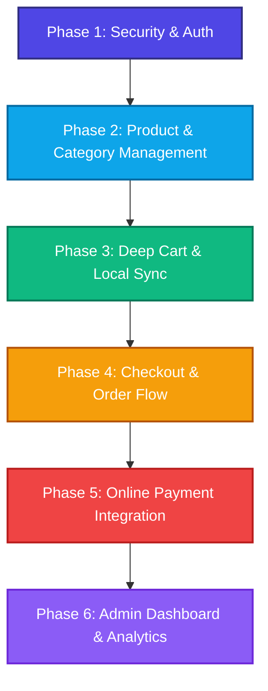

# 🗺️ E-Commerce Webbanhang1 — Fullstack Project Roadmap

Xin chào! Tôi là **System Architect**, **Senior Fullstack Developer**, và là **Gia sư Lập trình** của bạn. 

Tôi đã quét toàn bộ mã nguồn của dự án **Webbanhang1** bằng các công cụ MCP chuyên nghiệp. Thật ấn tượng! Bạn đã khởi tạo một nền tảng vững chắc và rất có cấu trúc ở cả hai phía:
- **Backend (Spring Boot 4.0.6 / Java 21)**: Có kiến trúc phân lớp sạch sẽ, dùng MySQL, Flyway Migrations, Spring Security 6 với JWT (đã có Token Rotation, Refresh Token, Reset Token), Validation, Global Exception handling.
- **Frontend (Next.js 16.2.6 App Router / TypeScript)**: Cấu hình hiện đại với **Tailwind CSS v4**, **Framer Motion** (hiệu ứng mượt mà), **Zustand** (quản lý state), **SWR** (để fetch dữ liệu), và **React Hook Form + Zod** (để validate form).

Dưới đây là bản khảo sát hiện trạng chi tiết và **Roadmap phát triển toàn diện** từ A-Z được chia thành **6 Phase**.

---

## 🔍 Khảo Sát Hiện Trạng Hệ Thống (Current State Survey)

### 1. Database Schema (`backend-ecommerce/src/main/resources/db/migration/`)
*   **Đã có (100%):**
    *   `roles` & `users`: Quản lý tài khoản (ADMIN, USER) và trạng thái hoạt động. (Đã seed `admin@gmail.com` và `user@gmail.com` với pass `123456` ở `V8`).
    *   `categories` & `products` & `product_images`: Danh mục, sản phẩm (với giá, mô tả, ảnh thumbnail) và bảng lưu nhiều ảnh chi tiết sản phẩm.
    *   `refresh_tokens` & `password_reset_tokens`: Cơ chế xoay vòng token (Token Rotation) bảo mật cao và mã đặt lại mật khẩu ngắn hạn.
    *   `carts` & `cart_items`: Giỏ hàng persistent gắn liền với user (mỗi user 1 giỏ hàng duy nhất).
    *   `orders` & `order_details`: Đơn hàng, chi tiết đơn hàng cùng các cột `payment_method` (mặc định COD) và `payment_status` (mặc định PENDING).

### 2. Backend API Layout (`com.ecommerce.backend_ecommerce`)
*   **Đã có (Hoạt động tốt):**
    *   `auth`: Đăng ký, đăng nhập, refresh token, quên mật khẩu, reset mật khẩu.
    *   `user`: Lấy thông tin cá nhân, cập nhật hồ sơ, đổi mật khẩu.
    *   `category`: CRUD các danh mục sản phẩm.
    *   `product`: CRUD sản phẩm, tìm kiếm nâng cao (phân trang, sắp xếp, lọc theo danh mục, giá), upload ảnh sản phẩm.
    *   `cart`: Đồng bộ giỏ hàng từ client lên DB (thêm, cập nhật, xóa item).
    *   `order`: Đặt hàng (checkout), xem lịch sử mua hàng, chi tiết đơn hàng, admin cập nhật trạng thái đơn hàng.

### 3. Frontend App Layout (`front-end-ecommerce/src/`)
*   **Đã có (Một phần):**
    *   `AuthContext.tsx` & `api.ts`: Xử lý lưu token, tự động Refresh Token, đính kèm Bearer token vào request.
    *   `HomePage` (`/`): Hiển thị sản phẩm mới nhất (sử dụng React 19 Server Component + SWR).
    *   `ProductDetail` (`/product/[id]`): Xem chi tiết sản phẩm, đổi ảnh phụ, chọn số lượng, thêm vào giỏ hàng.
    *   `SearchPage` (`/search`): Lọc sản phẩm theo danh mục, khoảng giá, sắp xếp, và thanh tìm kiếm từ khóa.
    *   `CartStore` (`useCartStore.ts`): Store Zustand đồng bộ giỏ hàng giữa LocalStorage và Backend Database.
    *   `CheckoutPage` (`/checkout`): Nhập thông tin thanh toán, chọn phương thức COD/Chuyển khoản để đặt hàng.
    *   `OrderHistory` (`/profile/orders`): Hiển thị danh sách đơn hàng đã mua.
    *   `AdminPage` (`/admin`): Trang tổng quan quản lý dạng basic skeleton.
*   **Còn thiếu (Cần làm mới):**
    *   Trang đăng ký tài khoản (`/register`).
    *   Trang quên mật khẩu và đổi mật khẩu (`/forgot-password`, `/reset-password`).
    *   Cơ chế bảo vệ Route (Middleware/Route Guards) để chặn user thường vào `/admin` và khách chưa đăng nhập vào `/profile`, `/checkout`.
    *   Trang quản lý sản phẩm, danh mục cho Admin (CRUD Admin Panel).
    *   Tích hợp cổng thanh toán thực tế (VNPAY/MOMO/Stripe) thay vì chỉ COD giả lập.
    *   Các hiệu ứng cao cấp và tối ưu giao diện theo tiêu chuẩn **Premium Design** (Anti-Template Policy).

---

## 🗺️ E-Commerce Fullstack Roadmap (6 Phases)

Mỗi module sẽ tuân thủ nghiêm ngặt quy trình:
1.  **Phân tích Database Schema** (Bảng, Cột, Khóa ngoại).
2.  **Xây dựng/Tối ưu Backend** (Entity -> Repository -> Service -> Controller).
3.  **Hướng dẫn cực chi tiết Frontend Next.js** (Server/Client Components, state management, giải thích dòng chảy dữ liệu bằng tiếng Việt, chia nhỏ component).

---

### Phase 1: Authentication & Authorization (Bảo mật & Phân quyền)
> **Trọng tâm:** Hoàn thiện luồng đăng ký, đăng nhập, bảo vệ ứng dụng Next.js, và xử lý phân quyền Admin/User.

*   **Database:** Kiểm tra cấu trúc bảng `users`, `roles`, `refresh_tokens`, `password_reset_tokens`.
*   **Backend:** Xác minh cơ chế Spring Security 6, JWT Filter, và các API `/api/auth/*`.
*   **Frontend (Next.js) - BẮT BUỘC LÀM MỚI & HOÀN THIỆN:**
    *   `[NEW]` Xây dựng trang Đăng ký (`/register`) sử dụng **React Hook Form** + **Zod Validation**.
    *   `[NEW]` Trang Quên mật khẩu (`/forgot-password`) & Đặt lại mật khẩu (`/reset-password`).
    *   `[NEW]` **Next.js Middleware** hoặc **Route Guards**: Chặn truy cập trái phép vào trang Admin (`/admin/*`) hoặc trang cá nhân (`/profile/*`, `/checkout`).
    *   `[MODIFY]` Tối ưu hóa UI Đăng nhập (`/login`) với các hiệu ứng Premium, chuyển động mượt mà bằng **Framer Motion**.
*   **Kiến thức học được (Tutor points):** 
    *   Hiểu rõ Next.js **Client Component vs Server Component** trong xác thực.
    *   Cách Next.js **Middleware** chạy ở Edge Runtime để bảo vệ route trước khi render.
    *   Cách quản lý Token trong **Cookie** an sau chống tấn công XSS/CSRF.

---

### Phase 2: Catalog System (Quản lý Danh mục & Sản phẩm)
> **Trọng tâm:** Hiển thị danh mục, tìm kiếm lọc sản phẩm động và xây dựng trang quản trị sản phẩm cho Admin.

*   **Database:** Kiểm tra bảng `categories`, `products`, `product_images`.
*   **Backend:** APIs tìm kiếm `/api/products` (lọc theo khoảng giá, categoryId, từ khóa tìm kiếm, phân trang).
*   **Frontend (Next.js) - NÂNG CẤP & BỔ SUNG:**
    *   `[MODIFY]` Tối ưu trang Home (`/`) & Tìm kiếm (`/search`) theo trường phái **Bento Grid** hoặc **Editorial Grid** sang trọng, phá cách (Anti-template).
    *   `[MODIFY]` Nâng cấp chi tiết sản phẩm (`/product/[id]`) với slider ảnh tương tác cao, hiệu ứng chuyển ảnh bằng Framer Motion, hiển thị trạng thái Stock (còn hàng/hết hàng).
    *   `[NEW]` Trang Admin Quản lý sản phẩm (`/admin/products`): Danh sách sản phẩm phân trang, form thêm/sửa sản phẩm trực quan, upload đa hình ảnh kéo thả qua `FileController`.
    *   `[NEW]` Trang Admin Quản lý danh mục (`/admin/categories`): CRUD danh mục.
*   **Kiến thức học được (Tutor points):**
    *   Kỹ thuật sử dụng **React Suspense** để tạo skeleton loading tuyệt đẹp.
    *   Cách tối ưu hóa hình ảnh với **Next.js `<Image>` component** (srcset, placeholder blur, WebP format).
    *   Kỹ thuật lưu trữ trạng thái tìm kiếm lên **URL Search Params** (giúp chia sẻ link lọc sản phẩm cho người khác).

---

### Phase 3: Persistent Cart (Giỏ hàng Đồng bộ Realtime)
> **Trọng tâm:** Xử lý giỏ hàng cực kỳ mượt mà, hỗ trợ cả khách vãng lai (Guest) và đồng bộ ngay lập tức lên database khi đăng nhập.

*   **Database:** Bảng `carts` và `cart_items`.
*   **Backend:** APIs `/api/cart` (thêm, cập nhật số lượng, xóa sản phẩm khỏi giỏ).
*   **Frontend (Next.js) - HOÀN THIỆN & POLISH:**
    *   `[NEW]` Xây dựng **Cart Drawer (Slide-out panel)** xuất hiện mượt mà ở cạnh phải màn hình khi click vào giỏ hàng ở Header.
    *   `[MODIFY]` Nâng cấp Zustand store (`useCartStore.ts`) để hỗ trợ **Optimistic Updates** (cập nhật giao diện ngay lập tức trước khi API phản hồi, tự động rollback nếu API lỗi).
    *   `[MODIFY]` Thuật toán đồng bộ: Khi User đăng nhập thành công, tự động gộp giỏ hàng LocalStorage tạm thời vào Database của User.
*   **Kiến thức học được (Tutor points):**
    *   Cách hoạt động của **Zustand Persist Middleware** (đồng bộ state vào LocalStorage).
    *   Tránh lỗi **Hydration Mismatch** trong Next.js khi dữ liệu LocalStorage khác biệt với server render.
    *   **Optimistic UI** - bí quyết làm ứng dụng chạy "nhanh như chớp".

---

### Phase 4: Order & Checkout Flow (Quy trình Đặt hàng & Xử lý Đơn hàng)
> **Trọng tâm:** Thiết lập quy trình đặt hàng chặt chẽ, kiểm tra tồn kho (Stock lock), và quản lý lịch sử đơn hàng.

*   **Database:** Bảng `orders`, `order_details`.
*   **Backend:** Tối ưu hóa API đặt hàng `/api/orders`: Tự động trừ số lượng tồn kho (`products.stock`), trả về lỗi nếu không đủ hàng, tạo đơn hàng trong Transaction để đảm bảo tính toàn vẹn dữ liệu.
*   **Frontend (Next.js) - HOÀN THIỆN & POLISH:**
    *   `[MODIFY]` Tối ưu trang `/checkout`: Form điền thông tin thông minh, tự động điền thông tin từ Profile của User, hiển thị tóm tắt đơn hàng siêu chi tiết.
    *   `[MODIFY]` Tối ưu trang lịch sử đơn hàng `/profile/orders`: Phân loại đơn hàng theo trạng thái (Đang chờ, Đã xác nhận, Đang giao, Đã giao, Đã hủy).
    *   `[NEW]` Trang chi tiết đơn hàng cho khách hàng (`/profile/orders/[id]`): Theo dõi trạng thái đơn hàng dưới dạng **Timeline Progress** trực quan.
*   **Kiến thức học được (Tutor points):**
    *   Quản lý Form phức tạp với **React Hook Form** và xử lý lỗi Validation lồng nhau.
    *   Luồng luân chuyển dữ liệu từ Cart Store -> Checkout State -> API Payload -> Database.

---

### Phase 5: Online Payment Integration (Tích hợp Thanh toán Online)
> **Trọng tâm:** Kết nối cổng thanh toán trực tuyến (VD: VNPAY hoặc MOMO Sandbox) để có quy trình mua sắm thực tế khép kín.

*   **Database:** Cập nhật bảng `orders` (nếu cần điều chỉnh thông tin giao dịch).
*   **Backend - LÀM MỚI:**
    *   `[NEW]` Tích hợp thư viện thanh toán VNPAY/MOMO.
    *   `[NEW]` API tạo link thanh toán `/api/payment/create-payment-url`.
    *   `[NEW]` API IPN (Instant Payment Notification) nhận webhook từ cổng thanh toán để cập nhật tự động `payment_status = 'PAID'` an toàn từ server-to-server.
*   **Frontend (Next.js) - LÀM MỚI:**
    *   `[MODIFY]` Tại trang Checkout, nếu chọn "Thanh toán Online", sau khi tạo đơn hàng sẽ chuyển hướng User sang cổng thanh toán.
    *   `[NEW]` Trang kết quả thanh toán (`/checkout/payment-result`): Đọc kết quả từ URL Params gửi về, hiển thị màn hình Success/Failure nghệ thuật với các hiệu ứng ăn mừng sinh động.
*   **Kiến thức học được (Tutor points):**
    *   Hiểu bản chất của cơ chế **Webhook/IPN** và tại sao không được tin cậy hoàn toàn vào Client redirect để xác nhận thanh toán.
    *   Kỹ thuật bảo mật chữ ký số (Checksum/HMAC SHA512) để chống giả mạo giao dịch.

---

### Phase 6: Admin Dashboard & Advanced Management (Bảng Điều khiển Quản trị)
> **Trọng tâm:** Thiết kế trung tâm quản trị toàn diện, xem biểu đồ doanh thu và quản trị toàn bộ người dùng, đơn hàng.

*   **Database:** Thiết lập các truy vấn thống kê dữ liệu.
*   **Backend - LÀM MỚI:**
    *   `[NEW]` API Thống kê `/api/admin/statistics`: Doanh thu theo tháng/ngày, số lượng đơn hàng mới, top 5 sản phẩm bán chạy, số lượng đăng ký mới.
    *   `[NEW]` API Quản lý đơn hàng nâng cao: Danh sách tất cả đơn hàng, cập nhật trạng thái đơn hàng (PENDING -> CONFIRMED -> SHIPPING -> DELIVERED -> CANCELLED).
*   **Frontend (Next.js) - BẮT BUỘC LÀM MỚI & HOÀN THIỆN:**
    *   `[MODIFY]` Thay thế trang Skeleton `/admin` cũ bằng một **Premium Bento Admin Dashboard** đầy phong cách.
    *   `[NEW]` Tích hợp biểu đồ trực quan (dùng **Recharts** hoặc **Chart.js** gọn nhẹ) hiển thị biểu đồ doanh thu dạng sóng mượt mà, phân cấp thông tin rõ ràng.
    *   `[NEW]` Trang Admin Quản lý Đơn hàng (`/admin/orders`): Danh sách đơn hàng toàn hệ thống, bộ lọc trạng thái, popup xem chi tiết và nút chuyển trạng thái giao hàng nhanh.
    *   `[NEW]` Trang Admin Quản lý Người dùng (`/admin/users`): Danh sách user, chức năng khóa/mở khóa tài khoản (`is_active`).
*   **Kiến thức học được (Tutor points):**
    *   Cách render đồ thị tương tác phía client mà không làm chậm tốc độ tải trang ban đầu.
    *   Kỹ thuật quản lý và tổ chức các Sub-layouts phức tạp cho khu vực Admin (`Nested Layouts` của Next.js).

---

## 🛠️ Cam Kết & Quy Tắc Đồng Hành Của Gia Sư

Khi bạn ra lệnh bắt đầu từng Phase, tôi sẽ luôn đồng hành cùng bạn và tuân thủ tuyệt đối:
1.  **Phân tích từ dưới lên (Bottom-up)**: Luôn đi từ DB -> Backend API -> Frontend UI.
2.  **Giảng dạy cặn kẽ**: Luôn gọi tên kỹ thuật Next.js rõ ràng (e.g. *Hydration*, *SWR Mutation*, *Server Action*, *State Lifting*), giải thích cơ chế dòng tiền/dữ liệu bằng ngôn ngữ bình dân nhất.
3.  **Code cực kỳ sạch sẽ**: Code sinh ra sẽ được comment tỉ mỉ bằng **tiếng Việt**, bóc tách thành các component nhỏ gọn, dễ hiểu, tránh dồn cục code quá 800 dòng.
4.  **Thiết kế đỉnh cao (Premium visual)**: Không dùng template Tailwind mặc định nhàm chán. Sử dụng các kỹ thuật phối màu HSL/Oklch thời thượng, chuyển động mượt mà, tạo chiều sâu layer để bạn luôn cảm thấy "WOW" trước giao diện.

---

> 🚀 **SẴN SÀNG:** Tôi đã nắm rõ mọi quy tắc và kiến trúc của dự án Webbanhang1. 
> Hãy gõ **`Bắt đầu Phase X`** (ví dụ: **`Bắt đầu Phase 1`**) để chúng ta cùng nhau phân tích chi tiết, thiết kế Database, viết Backend code và từng dòng code Next.js đầu tiên!
